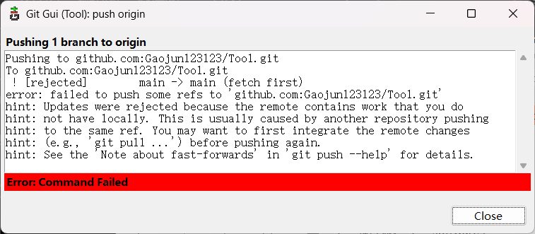

## git gui

rescan ：重新扫描当前的仓库

unstaged changes: 未缓存的变动

staged changes: 缓存的变动

stage changed: 暂存变化的 

sign off : 添加签名信息，这是可选的 。签名了代表有责任了。

如果远程被修改了，而本地没有修改。
例如

git fetch :从远程分支拉去最新的更新 

git pull : 从远程拉取并与本地的合并。

